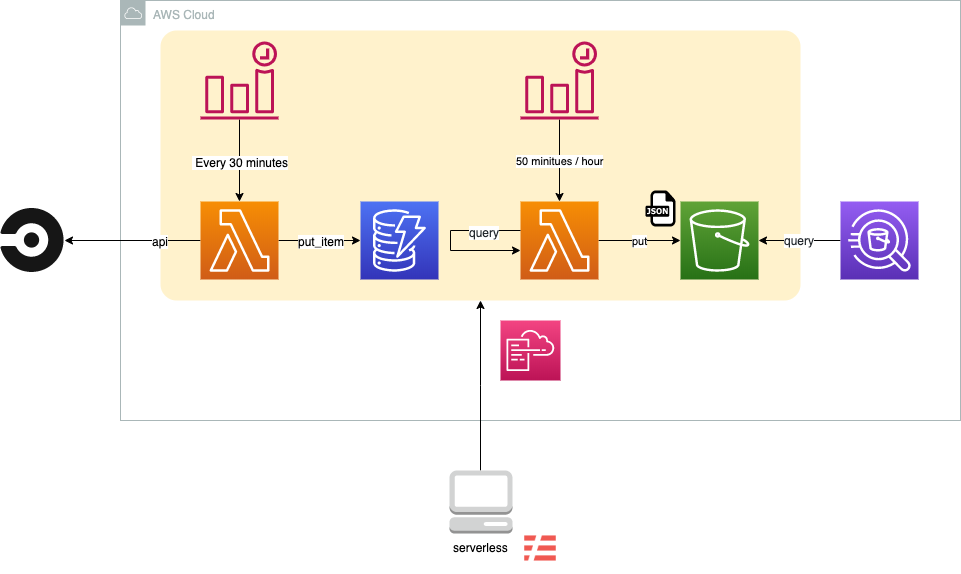

circleci-build-summary
====
CircleCIのビルド履歴をAthenaから参照できるように、S3にビルド履歴をJSONファイルで保存する

## Description

- [CircleCI API](https://circleci.com/docs/api/#recent-builds-across-all-projects)にてビルド履歴を取得する
- 取得したデータをDynamoDBに保存する
    - データの重複を排除する為に`reponame`をパーティションキー、`build_num`をソートキーに設定する
    - S3へデータを保存する時は、パーティションを跨いでデータを取得する為、`username`をハッシュキー、`queued_at`をレンジキーとしたGSIを設定する
- DynamoDBに保存されたデータから毎時のデータを取得し、JSONファイルとして保存する
```
<Bucketname>/year=<YYYY>/month=<MM>/day=<DD>/<YYYYMMDDHH>.json
```

## Requirement

## Usage
[serverless.yml](./serverless.yml)の`custom`パラメータを環境に合わせて設定してください。

|name|value|Default|Required|
|-|-|-|-|
|defaultRegion|リソースを作成するリージョン|us-east-1|no|
|defaultStage||dev|no|
|S3Bucketname|S3バケット名|-|yes|
|DynamodbTablename|Dynamodbテーブル名|-|yes|
|CircleciPersonalAccessToken|CircleCIのPersonalAccessToken|-|yes|
|GithubOrganization|Githubのオーガニゼーション名|-|yes|
|circleci-to-dynamodb.schedule|CirlceCIのビルド履歴取得スケジュール。（API発行時から最大過去100件しか取得できない為、ビルド件数が多い場合は実行感覚を短くしてください。）|cron(0/30 * * * ? *)|no|
|dynamodb-to-s3.schedule|S3のビルド履歴JSONファイル作成スケジュール。|cron(50 * * * ? *)|no|

## Install
[serverless](https://serverless.com/)にてデプロイを自動化している為、serverlessコマンドの実行環境を事前に作成する必要があります。

### serverless install
[公式に手順](https://github.com/serverless/serverless#quick-start)に従いserverlessをインストールします。

### plugin install
個別のプラグインをインストールします。
```bash
sls plugin install -n serverless-python-requirements
sls plugin install -n serverless-plugin-aws-alerts
sls plugin install -n serverless-pseudo-parameters
```

### athena table
S3のデータを参照する為にAthenテーブルを作成します。

データベース作成
```sql
CREATE DATABASE IF NOT EXISTS <Database Name>
```
テーブル作成
```sql
CREATE EXTERNAL TABLE <Table Name> (
  reponame string,
  status string,
  queued_at string,
  start_time string,
  stop_time string,
  build_time_millis int
)
PARTITIONED BY (year string, month string, day string)
ROW FORMAT SERDE 'org.openx.data.jsonserde.JsonSerDe'
LOCATION 's3://<S3Bucketname>/'
```
パーティション作成
```sql
MSCK REPAIR TABLE <Table Name>
```
パーティション情報表示
```sql
SHOW PARTITIONS <Table Name>
```

## Deploy
ステージをパラメータにて指定し、デプロイします。
```
sls deploy --verbose --stage dev
```

AWSのクレデンシャル情報が複数存在する場合は、PROFILE名を指定して実行します。
```
AWS_PROFILE=sandbox sls deploy --verbose --stage dev
```
